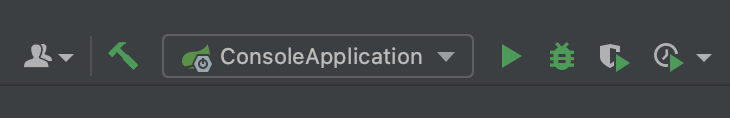

# 1RDS管控台功能介绍

RDS管控台是基于Java开发的应用程序，它为TongRDS-CN提供了节点状态跟踪／节点监控／数据维护等功能，支持单点模式／哨兵模式／集群模式/可伸缩集群模式 四种部署模式。

# 2名词定义

由于后续对于此平台的功能描述中涉及诸多基本概念，本节将介绍涉及的术语和先关名词定义。

**管控台：** 指的是TongRDS-CN管理控制台，支持通过WEB的方式进行TongRDS-CN服务以及节点的管理／TongRDS-CN服务以及节点的监控／TongRDS-CN服务的数据操作等功能．

**节点：** 即TongRDS-CN的节点，分为工作节点、哨兵节和代理节点两种类型．

**服务：** 即TongRDS-CN的服务，服务支持单点模式／哨兵模式／集群模式/可伸缩集群模式 四种部署模式；单点部署模式下，仅可添加一个工作节点；哨兵部署模式下，最少需要添加一个工作节点和一个哨兵节点；集群部署模式下，最少需要添加一个分片，每个分片最少需要添加一个工作节点。

# 3开发和编译
## 3.1前台工程开发和编译
前端工程采用NodeJS+VUE技术开发，所在目录 console-ui 
### 系统需求
Node >= 12
### 开发
``` 
# 进入项目目录, 安装依赖
npm install

# 建议不要直接使用 cnpm 安装依赖，会有各种诡异的 bug。可以通过如下操作解决 npm 下载速度慢的问题
npm install --registry=https://registry.npmmirror.com --legacy-peer-deps 

# 启动服务
npm run dev
```
浏览器访问 http://localhost:1024
### 发布
```bash
# 构建测试环境
npm run build:stage

# 构建生产环境
npm run build:prod
```

## 3.2后台工程开发和编译
后端工程采用Java+SpringBoot技术开发。
### 系统需求
JDK >= 1.8
Maven >= 3.0

### 正常编译并打包 ###
在项目根目录下执行下面命令， 会编译除console-release外的所有其他子工程。
针对所有的子工程，逐一清除原编译信息并生成新的编译后的jar包。

`mvn clean package`
### 系统发布打包（console-release） ### 
该过程由console-release子工程来完成，会生成最终的部署包到
console-release/target/console.tar.gz。
```
cd console-release
mvn clean package
```

### 开发环境配置 ###
首先保证整个工程的编译：
mvn clean package
进入到 console-release目录中，运行compile命令会拷贝必要的运行资源到根目录下的apphome中。
```
cd console-release
mvn clean compile
```

#### 在IDEA中运行工程 ####
- 用IDEA导入工程.
- 在console-release中运行compile命令用于准备运行环境（参看上一节）。
- 系统启动运行类, 指定console-admin子工程下的 com.tongtech.ConsoleApplication类为运行类；
  **注意** 在运行时要指定工作路径（Working directory)为 apphome
- 运行 ConsoleApplication 即可开启web运行环境。
  
  

#### 通过命令行运行工程 ####
在根目录中
```
# 在根目录下编译相关工程
mvn clean install -pl console-admin -am

# 进入 console-admin目录
cd console-admin

# 通过spring boot插件运行后台工程。
mvn spring-boot:run
```


# 4部署过程说明
## 4.1控制台支持的操作系统
Microsoft Windows 系列

Linux 平台

RedHat 系列

RedFlag 系列

Suse Linux 系列

## 4.2系统软件环境要求

Java环境：JDK1.8 及以上版本

内存：至少需要 1024MB 的内存

硬盘空间：至少需要 300MB 磁盘空间

浏览器：MicrosoftIE10、 Firefox3.0 、Chrome80及以上版本兼容ECMAScript 5的浏览器。

## 4.3安装操作过程

### 4.3.1环境配置

控制台安装需设置使用的 JDK 路径：

设置本机的 JAVA\_HOME 值，系统默认使用本机 JAVA\_HOME 所设置的 JDK 路径。

注：在启动控制台前，需先指定使用的 JDK 的路径。

### 4.3.2部署文件安装

控制台的安装程序是以tar.gz格式的文件提供。

将安装程序上传至服务器，然后使用解压缩工具进行解压，解压完成在当前目录会创建console目录，控制台运行所需文件均在此目录下。

### 4.3.3控制台系统配置说明

配置文件放置在config/目录下，其中的配置内容是在启动时加载生效（如要生效新变更的配置需重启管理控制台）。应用系统相关配置，对应配置文件"config/application.yml", 主要配置项说明：

- 应用的访问路径(环境路径)：配置项 server.servlet.context-path 默认值：/
- 服务端口：配置项 server.port 默认值：8083
- 中心节点管理端口进行通信时的授权码：配置项console.centerAuthKey 取值：提供的默认授权码。
注意：如果要修改请保证和中心节点中相应的授权码保持一致。中心节点如果是通过控制台自动安装的，会自动配置为何此配置项相同的值，无需人工修改。如果是另外部署的中心节点，就需要人工修改保持该授权码和中心节点的一致。
- 和节点管理器进行通信时的授权码: 配置项：console.probeAuthKey 取值：提供的默认授权码
注意：如果要修改请保证和节点管理器中相应的授权码保持一致。节点管理器如果是通过控制台自动安装的，会自动配置为何此配置项相同的值，无需人工修改。如果是另外部署手工部署节点管理器，就需要人工修改保持该授权码和节点管理器中的配置一致。

### 4.3.4控制台目录说明

系统运行的工作路径这里假设是apphome，控制运行时会以该路径为工作路径（或说应用主目录）

- apphome/apps 内置节点管理器部署节点的位置
- apphome/bin 控制台运行的脚本。
- apphome/config 控制台运行的配置文件。
- apphome/config/application.yml 控制台系统配置
- apphome/config/probe.config 内置节点管理器配置等
- apphome/data/db 内置数据文件存路径
- apphome/data/dbbak 内置数据备份文件
- apphome/lib 控制台运行程序库
- apphome/log 系统日志输出

### 4.3.5启动或停止控制台

将TongRDS-\*.Console.tar.gz的安装包解压后，把解压后的目录放置到您所需的安装路径（apphome 代表控制台的根目录），使用 apphome/bin 目录下的 Windows系统console.bat 启动文件，Linux系统console.sh 脚本即可启动 RDS控制台。

**启动控制台**

在命令行终端中，首先进入到apphome路径；之后执行：

console.sh start

如果运行正常会提示 Start console-admin.jar success..

**停止控制台**

在命令行终端中，首先进入到apphome路径；之后执行：

console.sh stop

如果运行正常会提示 console-admin.jar exited.

**查看控制台运行状态**

在命令行终端中，首先进入到apphome路径；之后执行：

console.sh status

如果系统正在运行，会显示：

APP\_HOME: /Path/installed/console

console-admin.jar is running...

如果系统没在运行，会显示：

APP\_HOME: /Path/installed/console

console-admin.jar is not running...

### 4.3.6验证安装

在浏览器中输入容器所在的宿主机IP地址和8083端口（如：[http://192.168.0.19:8083/](http://192.168.0.19:8083/)），可以正常访问到系统的登录页面。

# 5功能介绍

RDS管理控制台允许系统管理员以 Web 方式登录，并管理RDS服务、RDS节点，以及监控 RDS服务的运行状态。

## 5.1容器或容器云环境下的初始配置

### 5.1.1首次登录

RDS首次启动后，管理控制台通过http://IP地址:8083/ 在浏览器上进行访问。如果控制台启动正常会显示登录页面，如下图：


初次启动后,请使用默认的管理员用户进行登录，用户名：admin 密码：admin123。

为了提高系统安全性建议尽快对admin用户的密码进行更改，设置有一定安全强度的密码。更改密码可以通过，个人中心进行更改。

### 5.1.2中心节点的配置

容器云环境下是通过中心节点服务完整对容器云中RDS节点的注册发现、节点服务运行状态监控，节点弹性扩缩容等操作。

因此首先要配置中心服务的管理地址和端口，通过连接中心节点服务后来拉取相关的配置信息。

配置方式如下：


在中心服务菜单功能中点击"修改"按钮。


再修改界面中，部署环境要选为"k8s容器云","服务地址"请填写中心服务的访问地址，"管理关口"是中心服务的管理端口。


当填写完成并确定后，系统会去中心节点拉取配置信息，在20秒~60秒左右的时间后，界面中会展示出中心节点的列表。

## 5.2系统基础

用户管理提供用户添加／修改／删除／密码修改的功能。

角色管理提供角色添加／修改／删除；角色对应的功能权限设置。

## 5.3RDS管理

### 5.3.1中心服务

当控制台安装部署完成后会在本机自动安装一个中心节点，在系统初始化配置完成后自动启动。在管理控制台中的中心服务中可以查看中心节点状态，并可通过操作界面来启动和停止中心节点.

### 5.3.2RDS服务

服务管理提供服务节点信息的显示和状态显示，服务支持单节点／哨兵／集群三种部署模式。

### 5.3.3数据维护

RDS数据维护提供对运行状态的服务，进行五种基本数据类型（String/Hash/List/Set/ZSet）的查看／添加／修改／删除操作。

### 5.3.4命令行维护

RDS命令行维护提供对运行状态的服务，使用redis命令五种基本数据类型（String/Hash/List/Set/ZSet）的查看／添加／修改／删除操作。

## 5.4系统监控

### 5.4.1RDS服务监控

查看服务监控数据的步骤如下：

1. 依次展开管控台左侧导航树中的"系统监控－RDS服务监控"节点；

2. 所有服务的监控数据以列表的形式展现，列表支持根据服务名称／服务状态进行搜索，如下图所示。


点击列表中的服务名字，会跳转至此服务的监控详情页面，在这个页面可以查看服务及节点的运行状态／内存／连接数／每秒请求数，监控数据以图表的形式展示，如下图所示


### 5.4.2在线用户

在线用户提供查看当前登陆管控台的用户以及对强制退出登陆用户等

功能。

## 5.5系统审计

### 5.5.1操作日志

系统中所有的新建、修改、变更、删除等操作的历史都会被操作日志记录下来，且可以通过 系统审计》操作日志 界面进行查询、查看和导出操作。

### 5.5.2登录日志

登陆日志提供用户登陆日志的查询／导出／清空等功能。
